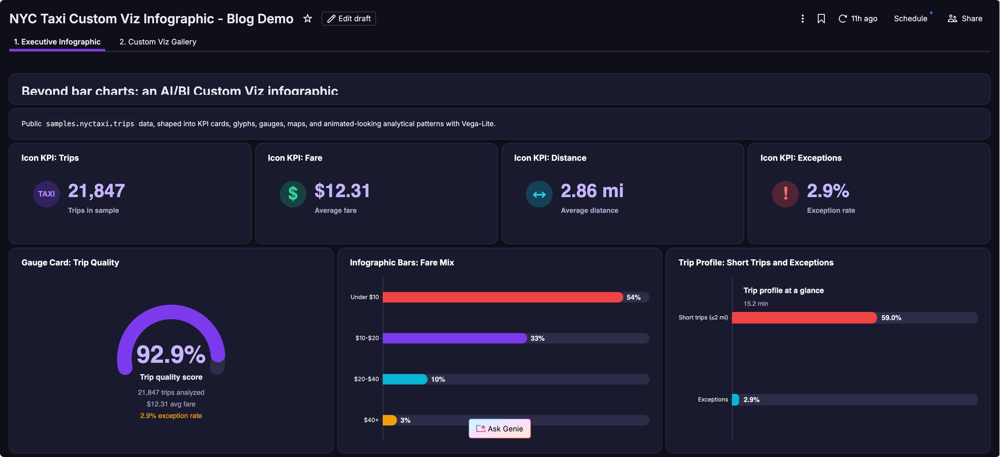
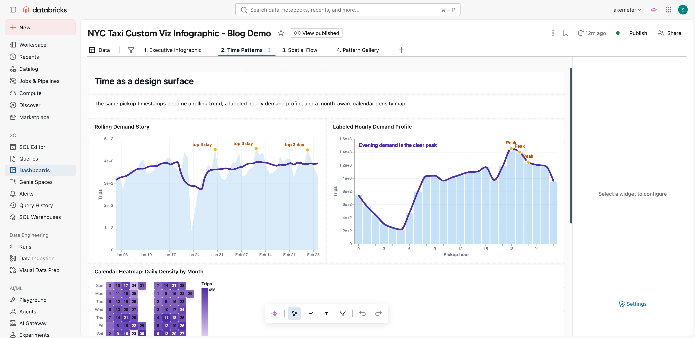
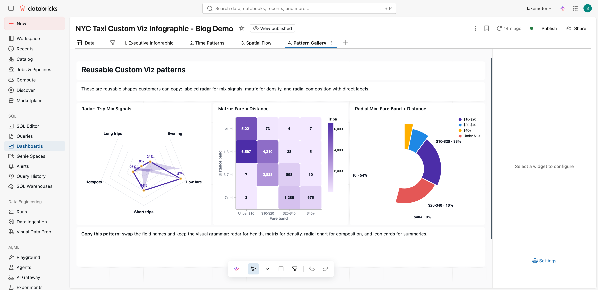

# Databricks AI/BI Custom Viz Dashboard

This repository contains an importable Databricks AI/BI dashboard that demonstrates infographic-style **Custom Visualizations** using Vega-Lite.

The dashboard uses only public Databricks sample data:

```sql
samples.nyctaxi.trips
```

## Preview

### Executive Infographic

An executive-facing page with product-style KPI cards, a gauge scorecard, fare mix, and trip profile summary.



### Time Patterns

Custom Viz patterns for annotated daily trends, labeled hourly demand, and a compact calendar heatmap.



### Pattern Gallery

Reusable patterns including a radar chart, fare-distance matrix, and radial composition chart.



## Files

- `nyc_taxi_custom_viz_dashboard.lvdash.json` - Importable AI/BI dashboard file.

## What The Dashboard Shows

The dashboard demonstrates how Databricks AI/BI Custom Viz can be used to create:

- Product-style KPI cards
- Gauge-style scorecards
- Annotated trend charts
- Labeled hourly demand profiles
- Dumbbell comparisons
- Butterfly charts
- Heatmap matrices
- Radial composition charts
- Variance-to-baseline charts

## Import The Dashboard

1. Download `nyc_taxi_custom_viz_dashboard.lvdash.json`.
2. In Databricks, open **SQL > Dashboards**.
3. Click the dashboard import option.
4. Choose `nyc_taxi_custom_viz_dashboard.lvdash.json`.
5. Import the dashboard.
6. Open the imported dashboard.
7. Attach or select a SQL warehouse.
8. Refresh the dashboard.

The dashboard should run as-is because it queries `samples.nyctaxi.trips`.

## How To Learn From It

Open the dashboard in edit mode and inspect each Custom Viz widget:

1. Open a widget.
2. Review the dataset fields exposed to the visualization.
3. Open the Vega-Lite JSON specification.
4. Look for how the widget references fields from `databricks_query`.
5. Copy the pattern into your own dashboard and replace the SQL fields.

The most important pattern is:

```json
{
  "data": {
    "name": "databricks_query"
  }
}
```

That is how the Vega-Lite specification references the result of the AI/BI dashboard dataset.

## Notes

- This dashboard is intended as an educational asset, not a production taxi analytics dashboard.
- The visual patterns are reusable across other business datasets.
- The underlying sample table is small, so the dashboard should be easy to run in most workspaces.

## References

- [Custom visualizations in AI/BI dashboards](https://docs.databricks.com/aws/en/dashboards/manage/visualizations/custom-visualizations)
- [Export, import, or replace a dashboard](https://docs.databricks.com/aws/en/dashboards/automate/import-export)

